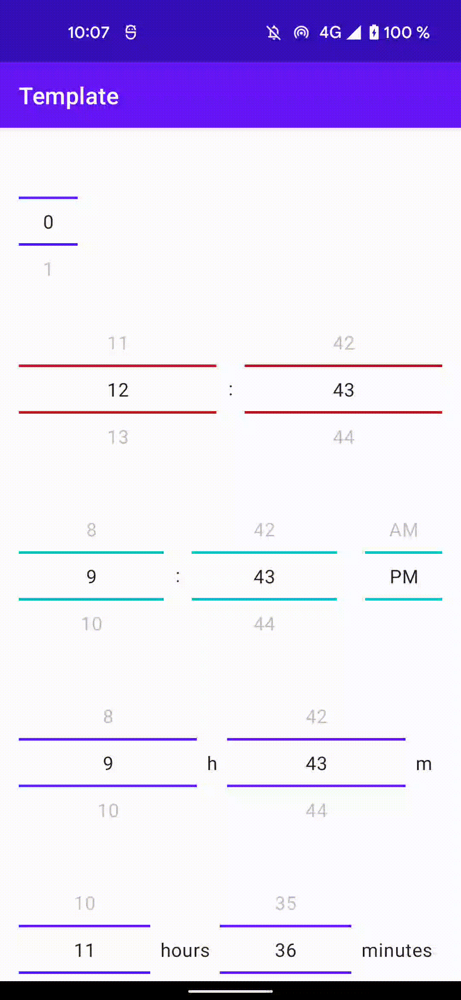

# Jetpack Compose Buttons Group

Android library providing a Buttons Group for Jetpack Compose.

[](https://chargemap.com)

[](https://maven-badges.herokuapp.com/maven-central/com.chargemap.compose/numberpicker)


## Showcase



## Installation

In your **module** *build.gradle* :

```
dependencies {
  implementation "com.chargemap.compose:buttonsgroup:latestVersion"
}
```

## Usage

### Simple ButtonsGroup

```


```

## Contributors

| [](https://github.com/r4phab) | [Raphaël Bertin](https://github.com/r4phab) |
|:------------------------------------------------------------------------------:|--------------|
