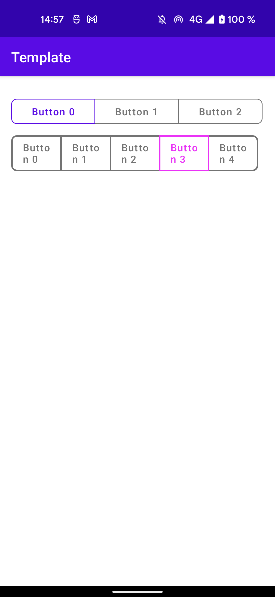

# Jetpack Compose Buttons Group

Android library providing a Buttons Group for Jetpack Compose.

[](https://chargemap.com)

[](https://mvnrepository.com/artifact/com.chargemap.compose/buttonsgroup)


## Showcase



## Installation

In your **module** *build.gradle* :

```
dependencies {
  implementation "com.chargemap.compose:buttonsgroup:latestVersion"
}
```

## Usage

### Simple ButtonsGroup

You may use any type of list to provide the group values. 
Here is an example with Integers : 

```
var state by remember { mutableStateOf(3) }

ButtonsGroup(
    modifier = Modifier
        .fillMaxWidth(),
    values = IntRange(0, 3).toList(),
    strokeWidth = 1.dp,
    strokeColors = StateColors(Color.Magenta, Color.DarkGray.copy(alpha = 0.75f)),
    backgroundColors = StateColors(Color.Magenta, Color.DarkGray.copy(alpha = 0.75f)),
    value = state,
    onValueChange = {
        state = it
    }
) {
    Text("Button $it")
}

```

## Contributors

| [](https://github.com/chargemap) | [Chargemap](https://github.com/chargemap) | Author |
|--------------|--------------|--------------|
